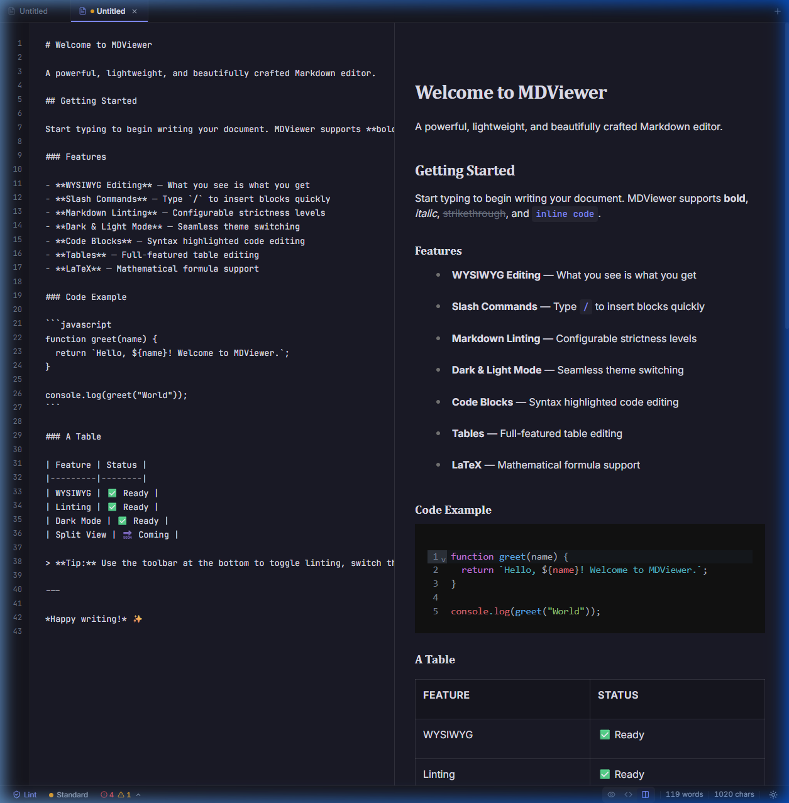
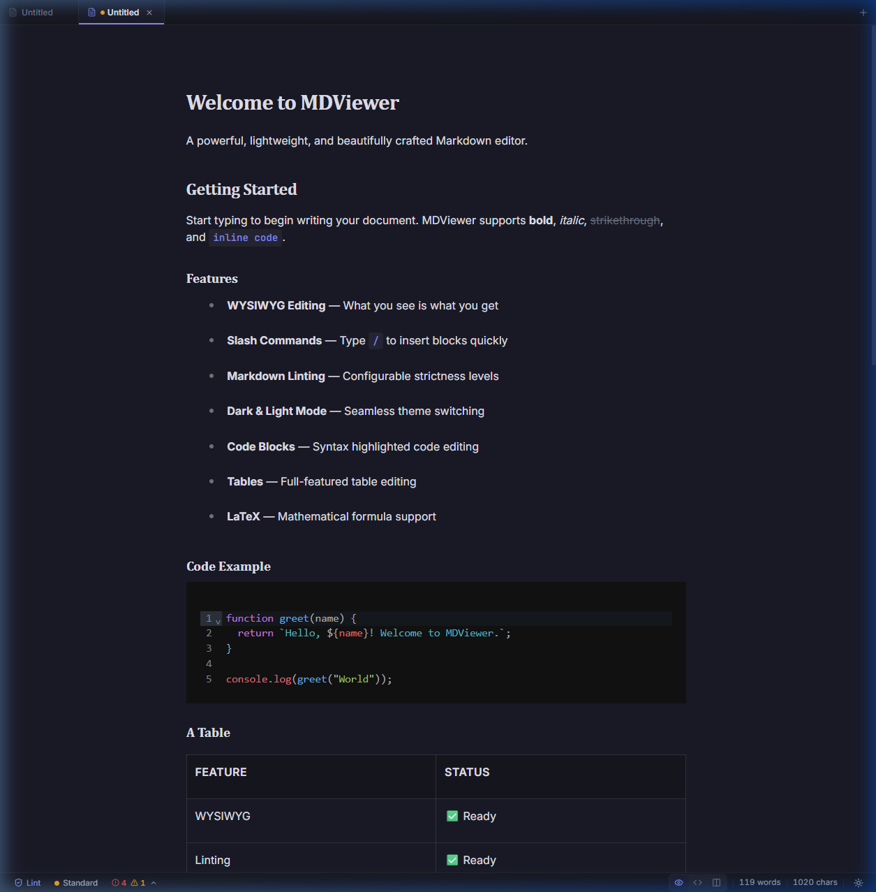
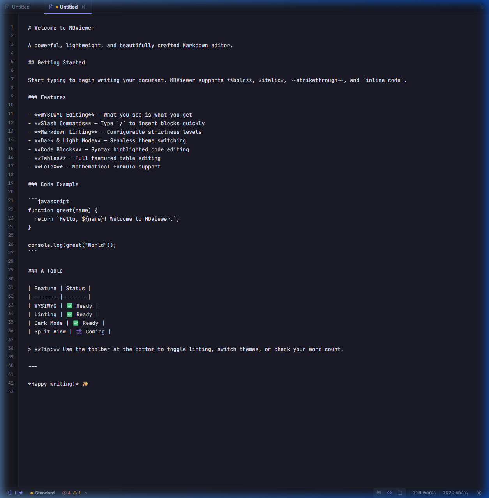

<div align="center">

# ✨ MDViewer

**Powerful. Lightweight. Beautiful.**

A modern, cross-platform Markdown editor built with React and Tauri.  
WYSIWYG editing, live split view, syntax highlighting, diagrams, math rendering, configurable linting, custom themes, and native performance.

[](https://github.com/jojo-swe/MDViewer/releases)
[](LICENSE)
[](#installation)

<br />



</div>

---

## Features

### 🖊️ Three Editor Modes

Switch seamlessly between the editing experience that suits you:

| Mode | Description |
|------|-------------|
| **WYSIWYG** | Rich, interactive editing — what you see is what you get |
| **Source** | Raw markdown with numbered lines and monospace styling |
| **Split** | Side-by-side source + live preview with synchronized scrolling |

<details>
<summary>📸 See all modes</summary>
<br />

| WYSIWYG | Source | Split |
|---------|--------|-------|
|  |  |  |

</details>

### 🎨 Rich Content Rendering

- **Syntax highlighting** — Code blocks highlighted with [Shiki](https://shiki.style/) (VS Code-quality themes, 15+ languages)
- **Mermaid diagrams** — Render flowcharts, sequence diagrams, and more (lazy-loaded only when needed)
- **Math/LaTeX** — Inline (`$E=mc^2$`) and block (`$$...$$`) math rendering via [KaTeX](https://katex.org/)
- **Image paste** — Paste images directly into the editor; saved automatically in Tauri, blob URL in browser

### 📑 Multi-Document Tabs

Open multiple files in tabs with dirty-state indicators, drag-and-drop file opening, fast tab cycling, and right-click context menus (Close, Close Others, Close All, Copy Path).

### 📂 File Explorer & Outline Sidebar

Browse and open files from any folder with a lazy-loaded tree view, or switch to the **Outline** mode for a table of contents generated from your markdown headings. Click any heading to jump to that section. Toggle with `Ctrl+B`, switch modes with `Ctrl+Shift+O`.

### 🔍 Find & Replace

Full-featured find with regex support, case sensitivity toggle, match navigation, **Replace**, and **Replace All** — all working on the actual markdown source.

### 📝 Markdown Linting

Configurable strictness levels (**Relaxed**, **Standard**, **Strict**) with real-time issue detection. See error/warning/info counts in the status bar and expand the lint panel for details.

### 🎨 Custom Theme System

Five built-in themes:
- **Light** — Clean, bright theme
- **Dark** — Default, polished dark theme
- **GitHub Dark** — Familiar GitHub dark aesthetic
- **Solarized Dark** — Classic Solarized dark palette
- **Solarized Light** — Classic Solarized light palette

Themes are applied dynamically via CSS variables. Select from the status bar or settings panel.

### ⌨️ Configurable Keyboard Shortcuts

Every shortcut is customizable. Open Settings → Shortcuts to:
- Click any shortcut to rebind it
- Detect and highlight conflicts
- Reset individual shortcuts or all shortcuts to defaults

### 🖱️ Context Menus

Right-click on tabs for quick actions: Close, Close Others, Close All, Copy Path.

### 📊 Status Bar

Real-time document statistics at a glance:
- Word count, character count, line count, paragraph count, reading time (click for details)
- Cursor position (Ln/Col) in source mode
- Selection count when text is selected
- File path display
- Auto-save status indicator
- Lint issue summary with expandable panel
- Editor mode toggle, theme toggle, settings access

### 🛡️ Safe Editing

- **Auto-save** — Automatically saves after a configurable idle period
- **Save before close dialog** — Never lose unsaved work
- **Toast notifications** — Clear feedback on save, open, export, and errors
- **Recent files** — Quick access to your last 10 documents from the welcome screen

### 📄 PDF Export

Export your document to PDF via the browser's native print dialog with theme-aware styling. `Ctrl+Shift+E`.

### 💻 Native Desktop App

Built on [Tauri](https://tauri.app/) for native performance with a tiny footprint. Custom frameless titlebar, native file dialogs, and platform-specific installers.

---

## Keyboard Shortcuts

All shortcuts are configurable via Settings → Shortcuts.

| Action | Default Shortcut |
|--------|-----------------|
| New Document | `Ctrl+N` |
| Open File | `Ctrl+O` |
| Save | `Ctrl+S` |
| Save As | `Ctrl+Shift+S` |
| Export PDF | `Ctrl+Shift+E` |
| Close Tab | `Ctrl+W` |
| Cycle Tabs | `Ctrl+Tab` / `Ctrl+Shift+Tab` |
| Toggle Sidebar | `Ctrl+B` |
| Toggle Outline | `Ctrl+Shift+O` |
| Find | `Ctrl+F` |
| Find & Replace | `Ctrl+H` |
| Command Palette | `Ctrl+Shift+P` |
| Settings | `Ctrl+,` |
| WYSIWYG Mode | `Ctrl+Alt+1` |
| Source Mode | `Ctrl+Alt+2` |
| Split View | `Ctrl+Alt+3` |

---

## Installation

### Download

Grab the latest release for your platform from [**Releases**](https://github.com/jojo-swe/MDViewer/releases):

| Platform | Format |
|----------|--------|
| Windows | `.msi` installer |
| macOS | `.dmg` disk image |
| Linux | `.AppImage` / `.deb` |

### Build from Source

**Prerequisites:** [Node.js](https://nodejs.org/) ≥ 18, [Rust](https://rustup.rs/), [Tauri prerequisites](https://v2.tauri.app/start/prerequisites/)

```bash
# Clone the repo
git clone https://github.com/jojo-swe/MDViewer.git
cd MDViewer

# Install dependencies
npm install

# Run in development mode (browser)
npm run dev

# Run as desktop app (Tauri)
npm run tauri dev

# Build production installers
npm run tauri build
```

---

## Tech Stack

| Layer | Technology |
|-------|-----------|
| **Frontend** | React 19, Vite, TypeScript (strict mode) |
| **Editor** | [Milkdown Crepe](https://milkdown.dev/) (ProseMirror-based) |
| **Desktop** | [Tauri v2](https://tauri.app/) (Rust backend) |
| **Syntax Highlighting** | [Shiki](https://shiki.style/) (lazy-loaded) |
| **Diagrams** | [Mermaid](https://mermaid.js.org/) (lazy-loaded) |
| **Math** | [KaTeX](https://katex.org/) + remark-math |
| **Icons** | [Lucide React](https://lucide.dev/) |
| **Linting** | Custom markdown linter with configurable rules |
| **CI/CD** | GitHub Actions — auto-build on `v*` tags |

---

## Project Structure

```
MDViewer/
├── src/
│   ├── components/              # UI components
│   │   ├── TitleBar.tsx         # Custom frameless titlebar
│   │   ├── TabBar.tsx           # Multi-document tabs with context menu
│   │   ├── Sidebar.tsx          # File explorer + outline mode
│   │   ├── Outline.tsx          # Table of contents from headings
│   │   ├── MilkdownEditor.tsx   # WYSIWYG editor (Shiki, Mermaid, KaTeX)
│   │   ├── SourceEditor.tsx     # Raw markdown editor with line numbers
│   │   ├── EditorModeToggle.tsx # WYSIWYG/Source/Split toggle
│   │   ├── FindReplace.tsx      # Find & Replace panel
│   │   ├── WelcomeScreen.tsx    # Start screen with recent files
│   │   ├── ConfirmDialog.tsx    # Save-before-close dialog
│   │   ├── ToastContainer.tsx   # Notification toasts
│   │   ├── StatusBar.tsx        # Stats, lint, theme, cursor position
│   │   ├── SettingsPanel.tsx    # Settings with shortcut editor
│   │   ├── CommandPalette.tsx   # Fuzzy command search
│   │   └── ContextMenu.tsx      # Reusable right-click menu
│   ├── hooks/                   # React hooks
│   │   ├── useSettings.ts       # Settings + theme application
│   │   ├── useLinter.ts         # Markdown linting
│   │   ├── useTabs.ts           # Multi-document state
│   │   ├── useRecentFiles.ts    # Recent files tracking
│   │   ├── useToast.ts          # Toast notifications
│   │   ├── useCommands.ts       # Command registry
│   │   ├── useAutoSave.ts       # Auto-save with debounce
│   │   ├── useSyncScroll.ts     # Split view scroll sync
│   │   ├── useOutline.ts        # Heading extraction for TOC
│   │   ├── useShortcuts.ts      # Configurable keyboard shortcuts
│   │   └── useContextMenu.ts    # Context menu state management
│   ├── utils/                   # Utilities
│   │   ├── fileManager.ts       # Tauri/browser file I/O
│   │   ├── linter.ts            # Lint rules engine
│   │   ├── pdfExport.ts         # Print-to-PDF export
│   │   ├── highlight.ts         # Shiki syntax highlighting
│   │   ├── mermaidRenderer.ts   # Mermaid diagram rendering
│   │   ├── mathRenderer.ts      # KaTeX math rendering
│   │   └── imageManager.ts      # Image paste/insert management
│   ├── themes/                  # Theme definitions
│   │   └── index.ts             # 5 built-in themes + applyTheme()
│   ├── commands/                # Command registry
│   │   └── registry.ts          # 20+ commands with shortcuts
│   ├── types/                   # TypeScript type definitions
│   └── test/                    # 214 tests across 27 files
├── src-tauri/                   # Tauri (Rust) backend
└── .github/workflows/           # CI/CD release pipeline
```

---

## Development

```bash
# Type checking
npm run typecheck

# Linting
npm run lint

# Run tests
npm run test:run

# Run tests with coverage
npm run test:coverage
```

---

## Contributing

Contributions are welcome! Please open an issue first to discuss what you'd like to change.

1. Fork the repository
2. Create your feature branch (`git checkout -b feature/amazing-feature`)
3. Commit your changes (`git commit -m 'feat: add amazing feature'`)
4. Push to the branch (`git push origin feature/amazing-feature`)
5. Open a Pull Request

---

## License

This project is licensed under the MIT License — see the [LICENSE](LICENSE) file for details.

---

<div align="center">

Built with ❤️ using React, Tauri, and Milkdown

</div>
